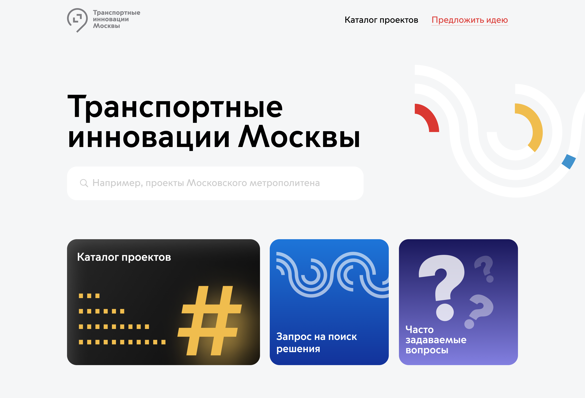

# 

## Команда
- [Дмитрий Пузырев](https://t.me/dipuzyrev) - бэкенд
- [Платон Лапп](https://t.me/SeamMiner) - фронтенд
- [Александр Щеблыкин](https://t.me/greeneboy) - десигн

## О проекте

Платформа для удобной навигации по продуктам акселератора “Транспортные инновации Москвы”. Сервис позволяет представителям транспортных компаний легко найти релевантные инновационные решения для внедрения. Если подходящих проектов не найдено, компании могут оставить заявку на скаутинг новых решений на рынке.

Помимо основной функции, наше решение помогает сотрудникам акселератора собрать всю информацию по проектам в одном месте и вести трекшн проектов без использования множества разных сервисов.

Также, мы предлагаем функцию анализа поисковых запросов клиентов, что позволяет акселератору понять перспективные интересные компаниям сферы даже при отсутствии конкретных заявок на скаутинг проектов.

Стек: VueJS, Django, DRF, PostgreSQL

## Демо

[Ссылка на видео](https://drive.google.com/file/d/1VzpKUVerp2Ma0_YV0ditff-3aoB2_7uh/view?usp=sharing)




## Технологический стэк

- [Django](https://www.djangoproject.com/) - свободный фреймворк для веб-приложений на языке Python
- [DRF](https://www.django-rest-framework.org/) -  библиотека, которая работает со стандартными моделями Django для создания гибкого API
- [Vue 3](https://v3.ru.vuejs.org/) - прогрессивный JavaScript-фреймворк для создания фронтенда веб-приложения
- [Vuex](https://vuex.vuejs.org/ru/) - официальный менеджер состояний для VueJS
- [Router](https://router.vuejs.org/ru/) - официальный маршрутизатор для VueJS


## Локальный запуск

```bash
git clone https://github.com/dipuzyrev/tim && cd tim

# Start API
cd backend
python3 -m venv env
source ./env/bin/activate  # WIN: "env\Scripts\activate"
pip install -r requirements.txt
python manage.py runserver

# Start frontend
cd ../frontend
yarn && yarn serve
```


### Локальные ссылки

- [Django админка](http://localhost:8000/admin/) (root@example.com / 111111)
